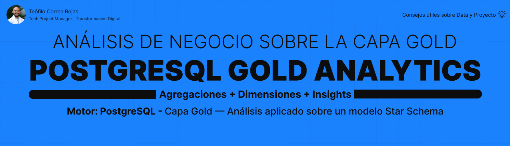

## 📌 Descripción

Este proyecto contiene **consultas analíticas de negocio** sobre la
capa Gold de una arquitectura Medallion en PostgreSQL. Utilizando el
modelo dimensional Star Schema construido previamente, responde
preguntas reales de ventas, rendimiento y comportamiento de clientes.

Cierra el ciclo completo de una plataforma de datos:
**datos → modelo → decisiones**.

---

## 🎯 Objetivos del proyecto

- Validar el modelo dimensional Gold con análisis reales
- Responder preguntas de negocio sobre ventas y rendimiento
- Aplicar agregaciones (SUM, COUNT) sobre la fact table
- Aprovechar las dimensiones para análisis multi-perspectiva
- Demostrar el valor analítico de la capa Gold

---

## 🏗️ Contexto — Análisis sobre Gold
```
Arquitectura Medallion
│
├── STG     ← datos crudos
├── Bronze  ← datos auditados
├── Silver  ← datos validados
└── Gold    ← modelo dimensional ← análisis aquí

Todas las consultas se ejecutan sobre `gold.fact_ventas` y sus
dimensiones. Gracias al modelo Star Schema, cada análisis requiere
JOINs simples entre la fact table y una dimensión.
```

---

## 🌟 Modelo analizado
```
            gold.dim_clientes
                     │
gold.dim_productos ──┼── gold.dim_empleados
│
gold.fact_ventas
│
gold.dim_tiempo
```
---

## 🧱 Estructura del proyecto


PostgreSQL_Gold_Analytics/
│
├── asset/
│   └── table_design_SQL_analytics.png
│
├── docs/
│   └── project_closure.md
│
├── sql/
│   ├── 01_ventas_productos/
│   │   ├── 01_unidades_por_producto.sql
│   │   ├── 02_ingresos_por_producto.sql
│   │   └── 03_top_productos.sql
│   │
│   ├── 02_analisis_temporal/
│   │   ├── 01_ventas_por_mes.sql
│   │   ├── 02_ventas_por_trimestre.sql
│   │   └── 03_ventas_por_anio.sql
│   │
│   ├── 03_rendimiento_equipo/
│   │   ├── 01_ventas_por_empleado.sql
│   │   └── 02_ventas_por_cargo.sql
│   │
│   └── 04_analisis_negocio/
│       ├── 01_ventas_por_categoria.sql
│       ├── 02_top_clientes.sql
│       └── 03_ventas_por_pais.sql
│
├── .gitignore
└── README.md
```
---

## 📊 Consultas por categoría

### 🟡 Ventas por Producto
| Consulta | Pregunta de negocio |
|---|---|
| Unidades por producto | ¿Cuántas unidades se vendieron de cada producto? |
| Ingresos por producto | ¿Cuánto generó cada producto? |
| Top 5 productos | ¿Cuáles son los más rentables? |

### 🟠 Análisis Temporal
| Consulta | Pregunta de negocio |
|---|---|
| Ventas por mes | ¿Cómo varían las ventas mes a mes? |
| Ventas por trimestre | ¿Qué trimestre fue mejor? |
| Ventas por año | ¿Cómo evolucionan las ventas anuales? |

### 🟢 Rendimiento del Equipo
| Consulta | Pregunta de negocio |
|---|---|
| Ventas por empleado | ¿Quién vende más? |
| Ventas por cargo | ¿Qué rol genera más ingresos? |

### 🔵 Análisis de Negocio
| Consulta | Pregunta de negocio |
|---|---|
| Ventas por categoría | ¿Qué categoría vende más? |
| Top 5 clientes | ¿Quiénes son los mejores clientes? |
| Ventas por país | ¿Dónde se vende más? |

---

## 💡 Técnicas aplicadas

| Técnica | Uso |
|---|---|
| `SUM()` | Totales de ventas e ingresos |
| `GROUP BY` | Agrupar por producto, tiempo, empleado |
| `ORDER BY` | Ranking de resultados |
| `LIMIT` | Top N (mejores productos/clientes) |
| `INNER JOIN` | Conectar fact table con dimensiones |

---

## 🎯 Patrón clave — "por X"

```sql
-- La estructura base de casi todo análisis
SELECT
    dimension.campo     AS categoria,
    SUM(fact.medida)    AS total
FROM gold.fact_ventas AS fact
INNER JOIN gold.dim_X AS dimension
    ON fact.X_id = dimension.id
GROUP BY dimension.campo
ORDER BY total DESC;
```

Cambiar el campo de agrupación (`mes`, `empleado`, `categoria`, `pais`)
genera un análisis diferente con la misma estructura.

---

## 🔗 Proyectos relacionados

| # | Proyecto | Descripción |
|---|---|---|
| 1 | [PostgreSQL_Database_Infrastructure](https://github.com/teofilocorrea/PostgreSQL_Database_Infrastructure) | Base de datos y esquemas |
| 2 | [PostgreSQL_Table_Design](https://github.com/teofilocorrea/PostgreSQL_Table_Design) | STG Layer |
| 3 | [PostgreSQL_Bronze_Layer](https://github.com/teofilocorrea/PostgreSQL_Bronze_Layer) | Bronze Layer |
| 4 | [PostgreSQL_Silver_Layer](https://github.com/teofilocorrea/PostgreSQL_Silver_Layer) | Silver Layer |
| 5 | [PostgreSQL_SQL_Queries](https://github.com/teofilocorrea/PostgreSQL_SQL_Queries) | Consultas SQL |
| 6 | [PostgreSQL_Gold_Layer](https://github.com/teofilocorrea/PostgreSQL_Gold_Layer) | Modelo dimensional |
| 7 | PostgreSQL_Gold_Analytics | Análisis de negocio ← estás aquí |

---

## 👤 Autor

### Teófilo Correa Rojas

**Project Manager Digital | Data analytic**

🔗 [LinkedIn](https://www.linkedin.com/in/teófilo-correa-rojas/)